# Задание 1

## Пункт 1

Создаём ДК-файл:

    vim docker-compose.yaml

Записываем в него следующее:

    version: '3.9'
  
    services:
    
      db:
        image: mariadb:10.10.2
        restart: always
        environment:
          MYSQL_ROOT_PASSWORD: 12345
                
      adminer:
        image: adminer:4.8.1
        restart: always
        ports:
          - 6080:8080

Поднимаем контейнеры:

    sudo docker compose up -d

Вывод последней команды (сокращённо):

    ...
    [+] Running 3/3
    ✔ Network hw_default      Created
    ✔ Container hw-adminer-1  Started
    ✔ Container hw-db-1       Started

Доказательства выполнения:

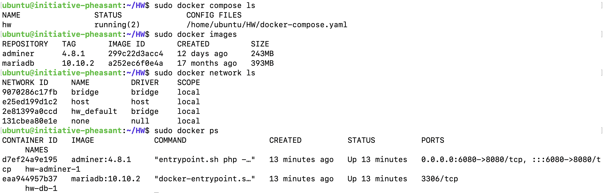

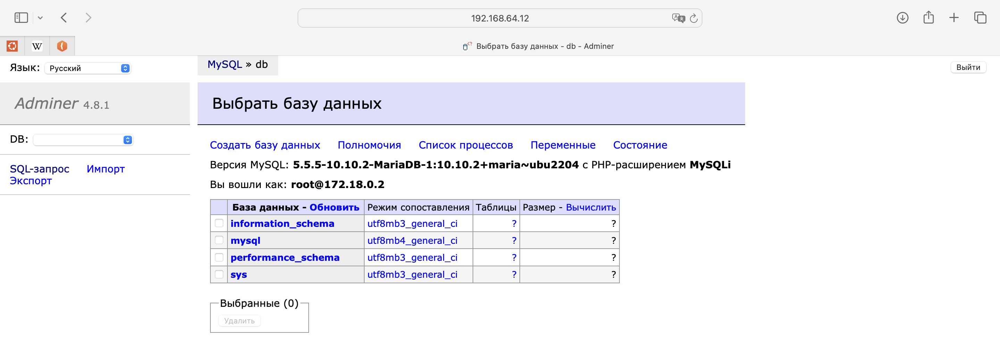

## Пункт 2

Включаем Docker Swarm:

    sudo docker swarm init

Во второй виуртальной машине выполняем команду

    sudo docker swarm join --token SWMTKN-1-4jm2i02j92hqzxmxq1tgrvt3p6nycc07dl942hxv523l1l5wzf-9284kbr7kiwl7wwldnkvgu03h 192.168.64.12:2377

При этом на второй машине получаем следующий вывод:

    wldnkvgu03h 192.168.64.12:2377
    This node joined a swarm as a worker.

Дальнейшие действия вополняется на первой виртуальной машине. Так, команда

    sudo docker node ls

даст вывод, представленный на картинке ниже

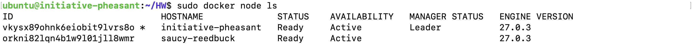

(`initiative-pheasant` - название первой машины, `saucy-reedbuck` - второй).

Создаём сеть для подключения сервисов:

    sudo docker network create --driver overlay my-network --attachable

Привязываем метки к нодам (метку `prod` - к первой и метку `dev` - ко второй):

    sudo docker node update --label-add env=prod initiative-pheasant
    sudo docker node update --label-add env=dev saucy-reedbuck

Проверим, что метки добавлены с помощью команд

    sudo docker inspect initiative-pheasant

и

    sudo docker inspect saucy-reedbuck

В выведенных конфигурациях будут содержаться следующие строки:

    ...
    "Labels": {
        "env": "prod"
    },
    ...

и

    ...
    "Labels": {
        "env": "dev"
    },
    ...

соответственно.

Создаём сервис на ноде с меткой `dev`:

    sudo docker service create --name mariadb_service --replicas 2 -e MYSQL_ROOT_PASSWORD=12345 -p 3306:3306 --network my-network --constraint node.labels.env==dev mariadb:10.10.2

Результат выполнения команды выглядит следующим образом:

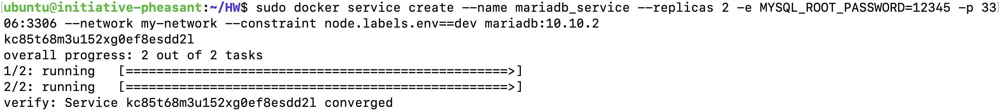

Проверим, что сервисы привязаны к правильной ноде:

    sudo docker service ps mariadb_service

В результате, как мы и хотели, сервисы привязаны только ко второй ноде (`saucy-reedbuck` с меткой `dev`):

# Задание 2

## Пункт 1

Создаём первый ДК-файл:

    vim compose_db.yml

и записываем в него следующее:

    version: '3.9'

    services:
    
      db:
        image: mariadb:10.10.2
        restart: always
        environment:
          MYSQL_ROOT_PASSWORD: 12345

Аналогично поступаем со вторым:

    vim compose_adminer.yml

и

    version: '3.9'
  
    services:
  
      adminer:
      image: adminer:4.8.1
      restart: always
      ports:
        - 6080:8080

Далее создаём соответствующие сервисы:

    sudo docker stack deploy -c compose_db.yml my_db_service

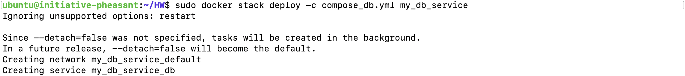

и

    sudo docker stack deploy -c compose_adminer.yml my_adminer_service

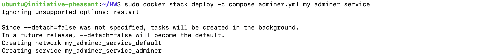

С помощью команды

    sudo docker service ls

удостоверимся в том, что сервисы созданы:

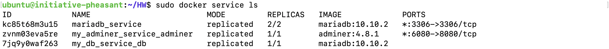

(сервис `mariadb_service` относится к первому заданию).

## Пункт 2

Добавляем первому сервису `my_adminer_service_adminer` метку `prod`:

    sudo docker service update --constraint-add node.labels.env==prod my_adminer_service_adminer

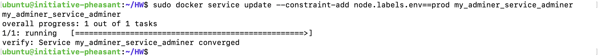

Сервису `my_db_service_db` добавляем метку `dev`:

    sudo docker service update --constraint-add node.labels.env==dev my_db_service_db

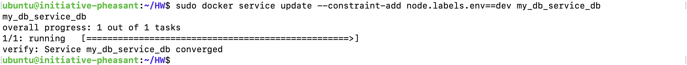

Командой 

    sudo docker service ps my_adminer_service_adminer

проверим, что сервис `my_adminer_service_adminer` остался на ноде `initiative-pheasant` с меткой `prod`:

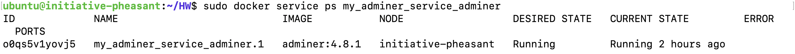

Команда

    sudo docker service ps my_db_service_db

позволит убедится в том, что сервис `my_db_service_db` был перенесён на ноду `saucy-reedbuck` с меткой `dev`:

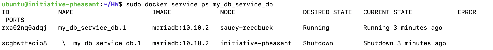